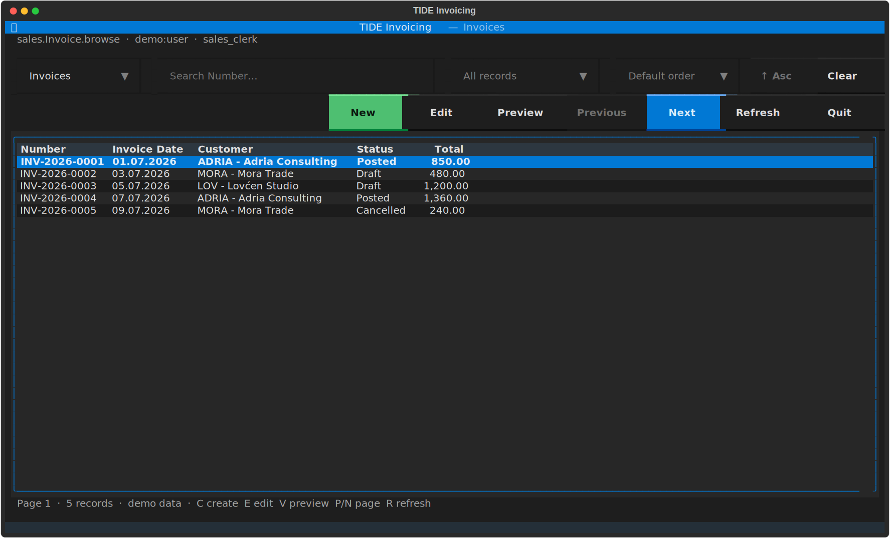
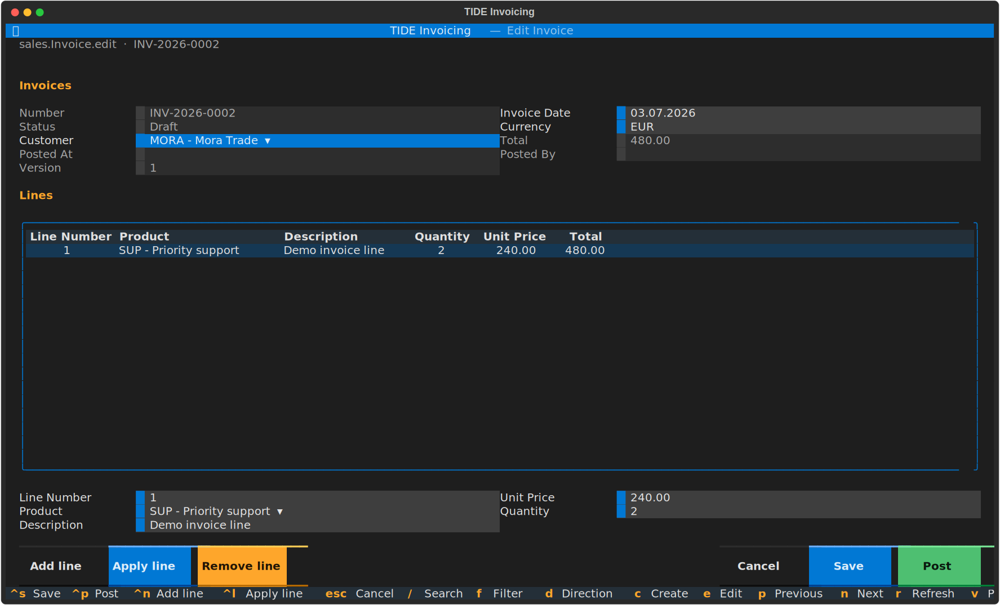
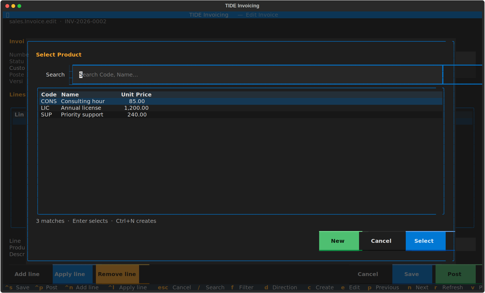

# TIDE

**Terminal Integrated Data Environment**

[](https://github.com/djordjen/tide/actions/workflows/ci.yml)
[](https://www.python.org/)
[](https://github.com/djordjen/tide/actions/workflows/ci.yml)
[](LICENSE)

> Model once. Run in any terminal.

TIDE is a proposed open-source, metadata-driven runtime and development
environment for database-oriented business applications. Its first-class
client is a keyboard-first, mouse-aware terminal interface that can run
locally or through SSH. REST, MCP, reports, and a future web interface use the
same application services, permissions, validation, and transaction model.

TIDE takes inspiration from:

- Clarion's integrated dictionary, browses, forms, reports, and extension
  points;
- web2py's coherent field-driven database, validation, and form behavior;
- XAF's Application Model, Object Space, Actions, security, modules, and model
  overlays.

It deliberately avoids editable generated code, implicit framework magic, and
deep abstraction hierarchies. Application structure is declarative; complex
business behavior remains ordinary Python.

New here? Follow [Getting Started](docs/GETTING-STARTED.md) to run the demo TUI,
open Studio, inspect REST/OpenAPI and MCP, and optionally connect SQL Server.
The first native [Qt GUI prototype](docs/QT-GUI.md) can also browse and inspect
records in the same secured remote application without database credentials.

## TUI preview

These captures come from the real Textual client running the bundled invoicing
application with deterministic demo data. Select an image to open it full size.

[](docs/images/tide-invoice-browser.svg)

<table>
  <tr>
    <th>Metadata-driven invoice editor</th>
    <th>Searchable multi-column product lookup</th>
  </tr>
  <tr>
    <td>
      <a href="docs/images/tide-invoice-editor.svg">
        
      </a>
    </td>
    <td>
      <a href="docs/images/tide-product-lookup.svg">
        
      </a>
    </td>
  </tr>
</table>

## Initial technology direction

- Python
- Textual
- SQLAlchemy and Alembic
- Pydantic
- SQLite for local development
- Microsoft SQL Server as the first multi-user deployment target
- PostgreSQL as a later certified dialect
- FastAPI for generated REST/OpenAPI
- the official Python MCP SDK
- standard-library print HTML plus optional ReportLab PDF rendering
- pytest

These are adapters around TIDE's application core, not the definition of the
core itself.

## Runnable headless slice

Python 3.11 is the current development and CI-certified baseline. Project
metadata permits Python 3.11 or later, but newer interpreters are currently
best-effort rather than part of the required CI matrix.

```bash
uv sync --extra dev
uv run tide model validate applications/invoicing
uv run tide model explain sales.Invoice.total --project applications/invoicing
uv run tide api export-openapi applications/invoicing
uv run --extra mcp tide mcp dev applications/invoicing
uv run tide app preview plan.json --workspace .
uv run tide app apply plan.json --workspace .
uv run --extra studio tide studio applications/invoicing
uv run tide run applications/invoicing --demo --page-size 3
uv run tide serve applications/invoicing --demo
uv run --extra mcp tide serve applications/invoicing --demo --mcp
uv run --extra client tide api check-server applications/invoicing
uv run pytest
```

`tide serve` requires a 32-character-or-longer development bearer token in
`TIDE_API_TOKEN` and binds to loopback. The Windows `start.bat api-demo`
shortcut generates one for local testing and prints the `/docs` address.
The separate `start.bat api-check` command securely prompts for that printed
token and verifies authentication plus application/wire compatibility through
the reusable remote client. `start.bat remote` then runs the same Textual
workflow through that API without giving the TUI a database connection string.
`start.bat mcp-demo` mounts authenticated schema/record/audit resources,
structured search and explicitly exposed CRUD tools, plus the Invoice Post
domain action at `/mcp`. They reuse the same service authorization, generated
inputs, protected values, exact types, concurrency, idempotency, correlation,
audit history, and principal-bound cursors as REST.
Use `start.bat mcp` for the equivalent persistent local SQL Server host.
The separate `tide mcp dev` stdio server exposes compiled project resources and
can turn an AI-authored sequence of logical TIDE operations into a deterministic
approval-required application proposal. It can also render that proposal into
a deleted temporary tree, run the normal compiler plus bounded static contract
checks, generate default views, and exercise fixed transition/sequence
templates through isolated in-memory CRUD, authorization, action, report, HTML
and optional PDF checks. It returns exact artifacts, hashes and a diff, but has
no MCP-side apply/workspace-write or arbitrary code/path tool. An explicit
local `tide app apply` command can bind those values to an absent destination,
require the exact interactive approval challenge, and atomically publish a new
application with an audit receipt; it never edits an existing application. Try
the complete local client workflow in the
[AI-assisted generation tutorial](docs/AI-GENERATION-TUTORIAL.md), and see
[AI-assisted application generation](docs/AI-APPLICATION-GENERATION.md) for the
architecture and security contract.
Existing applications now have a headless DesignerService with typed property/
order commands, atomic in-memory batches, compiler validation, exact comment-
preserving diffs and bounded undo/redo. `tide designer preview` remains no-
write; the separate interactive `tide designer save` command binds approval to
the canonical project path, live base, candidate and diff before transactionally
replacing only approved YAML files and recording a receipt. Saves now retain an
OS-owned lock plus a durable phase journal until cleanup. The read-only
`tide designer recover --preview` command inspects actual hashes; explicitly
approved recovery either restores the original YAML set or finalizes an already
receipted save. See
[Designers and reporting](docs/DESIGNERS-AND-REPORTING.md).
The first visible TIDE Studio slice can now be opened with `tide studio`. It is
a separate Textual developer screen with an application/entity/view/report/
source tree, nested scalar property inspector, YAML source, compiler diagnostics
and exact unified-diff views. Editable scalar leaves use typed in-memory
Designer commands. Schema `Literal` values such as field type and Boolean
properties use generated selection controls. The YAML source is syntax-colored
through the `studio` extra, and `Ctrl+F` searches YAML, diff, or diagnostics
with highlighted next/previous matches. **Edit YAML** provides an explicit
expert buffer; `Ctrl+S` applies strict YAML to the in-memory candidate, `Esc`
cancels it, and semantic identity changes are refused. Container,
schema-version and semantic identity property rows remain locked. Apply, undo
and redo recompile the candidate without writing source or opening the
application database. **Save candidate** opens the exact diff and changed-file
review, requires the complete evidence-bound approval phrase, and only then
invokes the transactional YAML-only `DesignerSaveService`. Stale sources and
active/interrupted save locks fail closed with recovery-preview guidance. On
view documents, a resolved TUI structure panel now shows table/lookup columns
and form/inline left-right field tracks with their metadata origin. **Move up**
and **Move down** reorder fields within a track through atomic Designer
commands. Same-position **Swap left/right** controls preserve YAML group
boundaries, while an entity-field chooser can add local placements and
**Remove field** removes only the view placement. Inline membership updates its
table columns and editor layout atomically. Form/inline additions now use an
explicit destination-group selector; **Groups…** creates, renames, reorders,
and removes empty local groups without crossing collection sections. Every
operation immediately recompiles and refreshes the diff and preview. On
Windows, `start.bat studio` opens the bundled invoicing project directly.
Closing Studio discards only an unsaved candidate.
For reviewed network deployments, `uv sync --extra api --extra auth` adds OIDC
discovery/JWKS access-token validation. `tide serve --auth oidc` requires an
exact issuer and audience, maps external roles explicitly to application roles,
and refuses a non-loopback bind unless a TLS certificate and key are supplied.
See [REST API and MCP](docs/API-AND-MCP.md#current-application-server).

`tide run --database-env` selects a persistent SQLAlchemy repository using the
`TIDE_DATABASE_URL` environment variable. The first managed-database run may
add `--create-schema`; later runs omit it. Database URLs and credentials remain
outside application metadata and command output. `tide db check` (or
`start.bat check` on Windows) performs a read-only connectivity, schema,
durable-state, and SQL-policy acceptance check. See
[Microsoft SQL Server](docs/SQL-SERVER.md#run-the-tui-against-sql-server).
Path-based SQLite deployments can use `tide db backup` to create a verified,
non-overwriting online snapshot plus SHA-256 manifest and
`tide db verify-backup` to recheck it. SQL Server uses native DBA-managed
backup and a real isolated restore followed by `tide db check`; see the
[recovery runbook](docs/OPERATIONS.md#database-changes-and-recovery).
`tide db diff` adds a deterministic, read-only schema proposal for managed
databases and a no-DDL compatibility report for legacy mappings. It classifies
changes, fingerprints the result, recognizes compiler-validated explicit rename
declarations without guessing, and performs no DDL. Exact reviewed fingerprints
can produce a non-overwriting Alembic-compatible revision plus SHA-256 manifest;
the optional migration adapter verifies that artifact and renders dialect SQL
without a database connection. TIDE still cannot apply it. See
[Schema migrations](docs/MIGRATIONS.md).

Here, "compiler" means a **metadata compiler**, not native executable or Python
bytecode compilation. It turns an application's YAML into a validated,
resolved, immutable `ApplicationModel`; production still runs the ordinary
Python TIDE runtime and application handlers.

The compiler currently provides a strict versioned source schema, duplicate-key
detection, source-located diagnostics, project path confinement, cross-file
relationship and view resolution, safe expression validation, computed-cycle
detection, JSON Schema export, and immutable normalized model output.

The headless runtime adds secured record/query/action services, a repository
protocol with in-memory and synchronous SQLAlchemy Core implementations,
`RecordSession`, computed master-detail values, field protection, validation,
action-owned state, idempotency, and optimistic concurrency. Managed SQLite
schema creation and legacy no-DDL mappings are executable. SQL predicate,
reference-path, and single-collection aggregate row policies are pushed into
root queries. SQL Server schema/query compilation and an opt-in live integration
suite establish it as the first multi-user target. Secured keyset pagination
uses opaque, principal-bound continuation cursors with matching behavior in the
in-memory and SQLAlchemy adapters. Action idempotency plus action/CRUD audit
state now share storage-neutral contracts with in-memory and explicitly managed
SQLAlchemy implementations; protected change values are redacted and
interrupted reservations fail closed instead of executing a handler twice.
Opt-in REST deletion now crosses the same service boundary, with
explicit permission/exposure, row-policy and version enforcement, stable
reference conflicts, and transactional relationship behavior in memory,
managed SQL, and legacy no-DDL SQL. The initial Textual adapter now interprets resolved browse and
form metadata for secured create/edit, inline InvoiceLine editing, validation,
cancel/save, optimistic-concurrency feedback, and audited invoice posting. It
can now select an explicitly configured SQLAlchemy deployment repository;
managed deployments use durable cursor, idempotency, action-audit, and
record-audit stores.
Stale TUI edits now open a three-way Original/Current/Your draft review. Users
may reload, continue inspecting their draft, or explicitly choose Current/Mine
for every overlapping field before rebasing. Non-conflicting draft fields are
retained automatically, while newly immutable workflow fields are never carried
forward.
The invoicing TUI also provides Invoice, Customer, and Product workspaces,
nested create-and-select lookups, and confirmed, permission-driven Customer and
Product deletion with readable reference-conflict feedback in local or remote
mode. An explicit deterministic Faker seeder supports empty managed development
databases. The selected Invoice can now be rendered
through a secured report service into a Textual preview, controlled CSV,
standalone HTML, or an A4 PDF with shared field formats. A second bounded
posted-sales report groups authorized invoices by Customer/Currency and
calculates invoice count and Decimal sales totals.

## Repository layout

Framework code and user applications have an explicit boundary:

```text
src/tide/                  reusable TIDE runtime and compiler
applications/
    invoicing/             a self-contained TIDE application
        tide.yaml
        runtime.py           explicit action/generator registrations
        demo_data.py         opt-in local demonstration records
        models/
        views/
        reports/
        security/
tests/                     framework contract tests
```

Each direct child of `applications/` is an application root. It may be
developed beside the runtime, packaged separately, or deployed with an
installed `tide-framework`; application source is not part of the runtime
wheel.

## Guiding principles

1. Terminal-first, keyboard-first, and fully mouse-aware.
2. One normalized application model drives every interface.
3. All interfaces use the same secured application services.
4. Useful defaults must produce a working application without a designer.
5. Declarative metadata must always have a clean Python escape hatch.
6. Model evolution, overrides, and extension points must be deterministic.
7. TIDE must remain useful for real multi-user business applications.
8. AI access is explicit, inspectable, permission-aware, and never privileged.

## Documentation

Start with [the documentation index](docs/README.md). Important documents are:

- [Getting started](docs/GETTING-STARTED.md)
- [Build your first TIDE application](docs/FIRST-APPLICATION.md)
- [Invoicing application walkthrough](docs/INVOICING-WALKTHROUGH.md)
- [REST API client tutorial](docs/API-CLIENT-TUTORIAL.md)
- [AI-assisted generation tutorial](docs/AI-GENERATION-TUTORIAL.md)
- [Qt GUI prototype](docs/QT-GUI.md)
- [Documentation plan](docs/DOCUMENTATION-PLAN.md)
- [Vision](docs/VISION.md)
- [Architecture](docs/ARCHITECTURE.md)
- [Application model](docs/APPLICATION-MODEL.md)
- [Schema migrations](docs/MIGRATIONS.md)
- [Legacy databases](docs/LEGACY-DATABASES.md)
- [Microsoft SQL Server](docs/SQL-SERVER.md)
- [Windows quick start](docs/WINDOWS-QUICKSTART.md)
- [Compilation and application layout](docs/COMPILATION-AND-LAYOUT.md)
- [Metadata contract v0.1](docs/METADATA-V0.md)
- [Presentation model](docs/PRESENTATION.md)
- [Expressions and validation](docs/EXPRESSIONS-AND-VALIDATION.md)
- [Security](docs/SECURITY.md)
- [REST API and MCP](docs/API-AND-MCP.md)
- [Query and concurrency](docs/QUERY-AND-CONCURRENCY.md)
- [Shared cursor storage](docs/CURSOR-STORAGE.md)
- [Record audit and action idempotency](docs/AUDIT-AND-IDEMPOTENCY.md)
- [Designers and reporting](docs/DESIGNERS-AND-REPORTING.md)
- [Terminal compatibility](docs/TERMINAL-COMPATIBILITY.md)
- [Threat model](docs/THREAT-MODEL.md)
- [Operational baseline](docs/OPERATIONS.md)
- [Headless runtime](docs/HEADLESS-RUNTIME.md)
- [Roadmap](docs/ROADMAP.md)
- [Decision log](docs/DECISIONS.md)

## Command-line direction

```bash
tide new invoicing
tide model validate
tide model explain sales.Invoice.customer
tide view explain sales.Invoice.edit
tide api export-openapi
tide db check
tide db diff
tide db migrate
tide studio
tide run
tide serve
tide report preview sales.invoice
```

## Current status

Milestones 0 and 1 are substantially implemented, and the secured application
core milestone is complete. The v0.1 compiler, resolved-view provenance, typed
expressions, headless services, in-memory and SQLite repositories, tests, and
executable invoicing workflow are implemented. Direct, reference-path, and
single-collection aggregate SQL policy translation and secured keyset
pagination are executable. Collection hydration now applies source-field,
target-entity, and target-row authorization through bounded relationship load
plans. Durable action reservations plus channel-aware action and CRUD audit
rows are implemented for memory and SQLAlchemy stores. SQL Server dialect
compilation is covered, with live certification available through an opt-in
integration suite.
Shared SQLAlchemy cursor storage preserves exact typed continuation state across
runtime restarts and processes while storing only hashes of bearer tokens. An
adapter-independent, read-only OpenAPI 3.1 preview now generates typed
Pydantic record/page schemas and explicitly exposed list/get contracts. The
first metadata-driven Textual invoicing workflow is runnable with
application-owned demo data, secured reference display, opaque paging,
create/edit forms, master-detail line editing, validation and concurrency
feedback, audited posting, invoice-number incremental search, named filters,
sortable stored scalar columns, and permission-gated action/record history
through keyboard or mouse controls. Secured
invoice and posted-sales summary reporting now provides terminal preview plus
CSV, HTML, and PDF export. A loopback-only FastAPI server hosts secured
list/get/create/update and Invoice Post routes with typed input, ETag
concurrency, idempotency, and
interactive OpenAPI documentation. An authenticated session-capability contract
and typed HTTP client now preserve exact field types, protected values, cursors,
ETags, and stable errors while rejecting mismatched applications and unsafe
unencrypted non-loopback URLs. Textual can now opt into this client through
`tide run --api-url`, including structured browse/search/sort, edit sessions,
lookups, nested lines, actions, and secured report preview/export without
database access. Provider-neutral OIDC/JWKS bearer validation and direct TLS
for network binds now provide the production identity foundation. Authenticated
runtime MCP now supplies metadata-opted schema/record/audit resources, bounded
structured search, secured CRUD mutations, and idempotent domain actions over
stateless Streamable HTTP. Local developer MCP now
provides project inspection, typed generation proposals, isolated compiler-
checked candidate previews, bounded in-memory runtime/renderer checks and exact
diffs without MCP-side apply. The separate local CLI now provides candidate-
bound interactive approval and atomic new-application publication. A comment-
preserving headless DesignerService now provides typed existing-application
edits, validation, diff and undo/redo. A separate local DesignerSaveService now
adds stale-base-bound interactive approval, per-file atomic replacement,
rollback, durable interruption recovery and receipts for existing YAML sources.
The first Textual Studio shell now exposes the semantic document tree, typed
in-memory scalar property editing, validation, undo/redo, diagnostics, exact
diff review, schema-derived selection controls, searchable previews and
syntax-colored YAML plus a bounded expert YAML apply/cancel mode on top of that
same headless service. Its explicit save review now connects a valid candidate
to the existing approval-bound transactional save, receipt and recovery
boundary without giving the editor direct file-write authority.
The first structural view-designer slice resolves list columns and form/inline
terminal field tracks, exposes provenance, and supports undoable in-track
reordering, same-group cross-column swaps, local field add/remove, explicit add
destinations, and safe local group management. Its **Layout…** editor now also
assigns portable tabs, reorders complete group/collection sections, adds or
removes compatible collection placements, and orders record/collection action
bars; the Textual form renderer consumes the same compiled tab and button-order
metadata. **Preview…** projects a selected view as any application role at
80×24, 100×30, or 140×40, showing shared-security field/action states and
terminal-fit warnings without records, database access, or application code.
The first Studio tranche is now hardened: hidden-field behavior matches the
live browse/form runtime, compact terminals scroll instead of clipping tools,
and invalid view candidates retain an explanation while designer actions fail
closed.
Interactive identity-provider login/refresh, trusted reverse proxies, MCP
mutations/actions, developer-MCP designer/save tools, richer report
parameters/group bands, and broader lookup-query capabilities remain roadmap
work.

Metadata v0.1 is an executable experimental contract. Breaking authoring
changes require a new `schema_version`; stable 1.0 compatibility is not yet
promised.

## License

TIDE is available under the permissive [MIT License](LICENSE). You may use,
modify, distribute, sublicense, and sell it, including as part of commercial or
private software, provided the copyright and license notice are retained.
