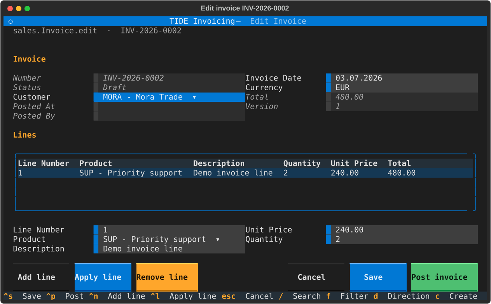
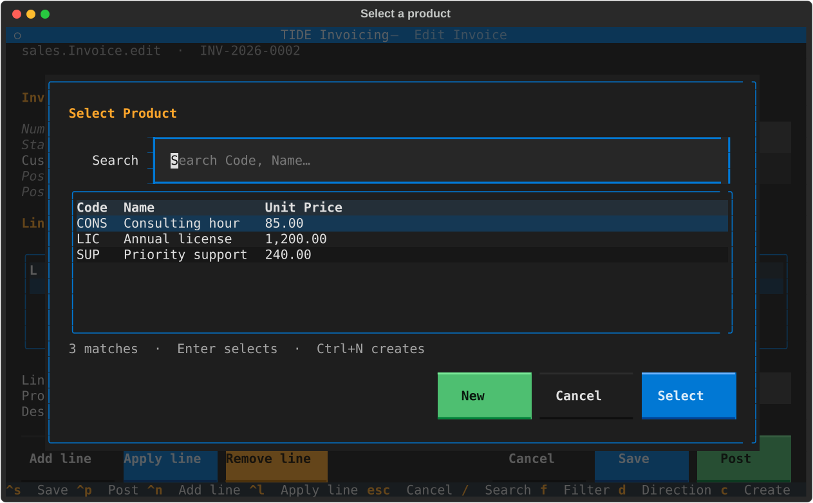
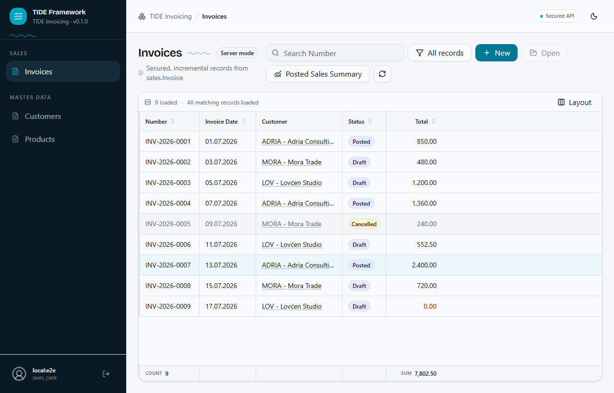
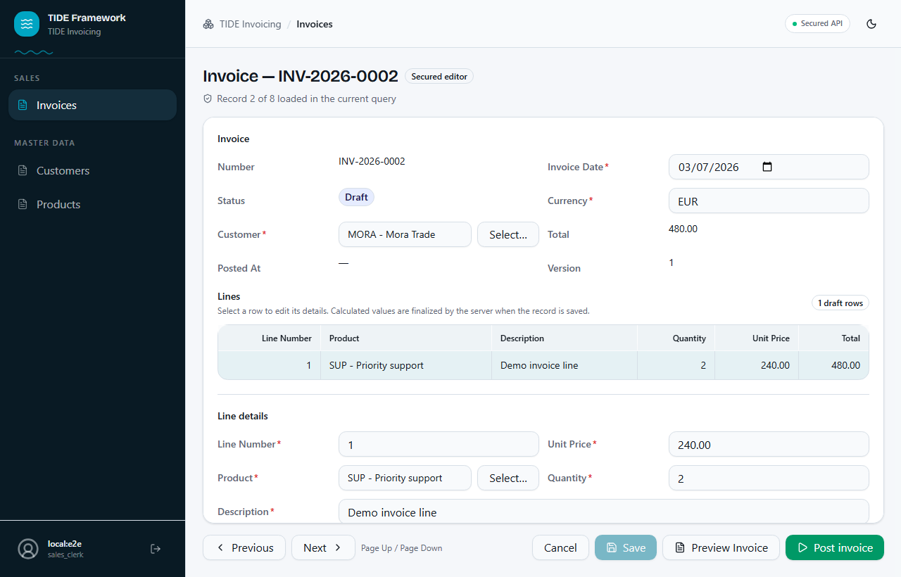
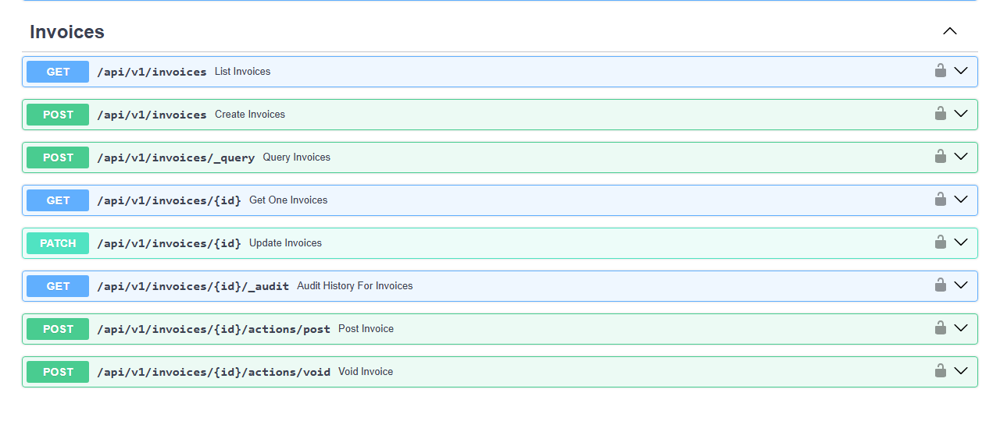
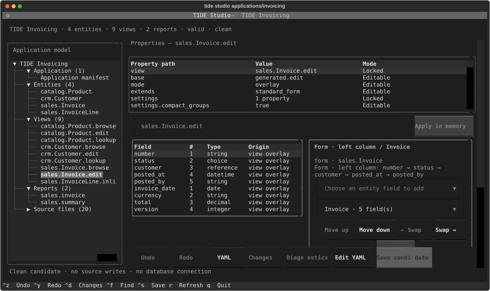

# TIDE Framework

**Terminal Integrated Data Environment**

[](https://github.com/djordjen/tide/actions/workflows/ci.yml)
[](https://www.python.org/)
[](https://github.com/djordjen/tide/actions/workflows/ci.yml)
[](LICENSE)

> Model once. Run in any terminal.

TIDE is a proposed open-source, metadata-driven runtime and development
environment for database-oriented business applications. Its first-class
client is a keyboard-first, mouse-aware terminal interface that can run
locally or through SSH. REST, MCP, reports, and the Web UI use the same
application services, permissions, validation, and transaction model.

TIDE takes inspiration from:

- Clarion's integrated dictionary, browses, forms, reports, and extension
  points;
- web2py's coherent field-driven database, validation, and form behavior;
- XAF's Application Model, Object Space, Actions, security, modules, and model
  overlays.

It deliberately avoids editable generated code, implicit framework magic, and
deep abstraction hierarchies. Application structure is declarative; complex
business behavior remains ordinary Python.

## What it looks like

One compiled application, seen through its clients. Every capture below is the
bundled invoicing application with its deterministic demo data, taken from the
running product: the terminal ones exported from the real Textual client, the
browser ones driven through Playwright against `tide serve`. MCP is the fourth
interface and the one with nothing to photograph. Select an image to open it
full size.

### Terminal

[](docs/images/tide-invoice-browser.svg)

<table>
  <tr>
    <th>Metadata-driven invoice editor</th>
    <th>Searchable multi-column product lookup</th>
  </tr>
  <tr>
    <td>
      <a href="docs/images/tide-invoice-editor.svg">
        
      </a>
    </td>
    <td>
      <a href="docs/images/tide-product-lookup.svg">
        
      </a>
    </td>
  </tr>
</table>

### Web

The same model, the same services, the same permissions, rendered by React
instead of by Textual. Sign-in is TIDE's own; the browse below is paged and
incremental, and every customer name in it arrived with the page rather than
costing a request.

[](docs/images/tide-web-invoices.png)

Forms are generated from the view, not hand-built, and are deliberately dense:
a field is a label and a control. What a principal may write, and which actions
are offered, come from the compiled model and are re-checked server-side.

[](docs/images/tide-web-invoice.png)

### REST

Only what the metadata exposes. `sales.Invoice` asks for `list`, `get`,
`create` and `update`, so the generated description offers those and no delete;
`post` and `void` are endpoints of their own because the model declares them as
actions, rather than a status field a client is trusted to set.

[](docs/images/tide-api-docs.png)

### Studio

Inspect and edit the compiled model with no database in the picture: the
resolved view, where each field came from, and its layout. Edits are applied to
an in-memory candidate, and no source file is written without an explicit
approval.

[](docs/images/tide-studio.svg)

## Quick start

Python 3.11 is the development and CI-certified baseline. Project metadata
permits 3.11 or later; newer interpreters are best-effort rather than part of
the required CI matrix.

```bash
git clone https://github.com/djordjen/tide.git
cd tide
uv sync --extra dev
```

Compile the bundled invoicing application. Nothing is running yet — this is the
compiler alone, and it is the quickest way to know the checkout is sound:

```bash
uv run tide model validate applications/invoicing
```

```text
Model is valid: TIDE Invoicing 0.1.0 (4 entities, 9 views, 2 reports, 0 warning(s)).
```

Now open it. No database is involved: `--demo` seeds an in-memory one from the
application's own sample records, and closing the process discards every
change. Press `q` to quit; the footer lists the other keys.

```bash
uv run tide run applications/invoicing --demo
```

On Windows, `start.bat demo` is the same command with the environment prepared.

### The other surfaces

The same compiled application, the same services, the same permissions. These
are alternatives rather than steps, and each runs until you stop it.

**Web UI** — the only surface a phone can run. Needs Node.js 20 or later.
Create the sign-in account once; it lives in a TIDE-owned SQLite file, separate
from the application's own data. The command prompts for a password and stores
no plaintext:

```bash
uv run tide auth create-user applications/invoicing \
  --store .tide/local-auth.sqlite3 --username admin \
  --role sales_clerk --role auditor
```

```bash
cd web && npm ci && npm run dev:demo
```

**Studio** — inspect and edit the resolved model with no database in the
picture. No source file is written without an explicit approval:

```bash
uv run tide studio applications/invoicing
```

**REST and the generated API description** — `serve` binds to loopback and
requires a development bearer token of at least 32 characters:

```bash
export TIDE_API_TOKEN=$(uv run python -c "import secrets; print(secrets.token_urlsafe(32))")
uv run tide serve applications/invoicing --demo
```

Open <http://127.0.0.1:8000/docs>, choose **Authorize**, and paste that token.
The description is served from TIDE's own files, so it works offline and under
TIDE's own content-security policy. In PowerShell, set the variable with
`$env:TIDE_API_TOKEN = ...`, or run `start.bat api-demo`, which generates and
prints one.

**MCP** — the same server with the read-only runtime MCP surface mounted:

```bash
uv run tide serve applications/invoicing --demo --mcp
```

**A second application** — `applications/invoicing` is a reference application,
not part of the runtime. The smaller generated
[Contacts application](applications/contacts/README.md) is the portability
proof, and every command above accepts it in place of `invoicing`:

```bash
uv run tide run applications/contacts --demo
```

`serve` on its own is REST and the API description: it gains the Web UI only
when given `--web-root` pointing at a build, and MCP only when given `--mcp`.
The Web command above sidesteps that by starting the API and the Vite
development server side by side; [Web UI](docs/WEB-UI.md) covers building the
renderer and hosting it from the one process instead.

[Getting started](docs/GETTING-STARTED.md) walks through each of these in turn,
with what to expect on screen and what to do when a step does not work.
[Build your first TIDE application](docs/FIRST-APPLICATION.md) starts from an
empty directory instead. On Windows, `start.bat` wraps every command above; run
`start.bat help` for the list.

## What is implemented

| Area | State |
| --- | --- |
| Metadata compiler (v0.1) | Validated, resolved, immutable model; source-located diagnostics |
| Headless services | Records, queries, actions, validation, audit, idempotency, optimistic concurrency |
| Repositories | In-memory and SQLAlchemy Core; managed SQLite and legacy no-DDL mappings |
| Databases | SQLite for development; SQL Server as the first multi-user target, certified by an opt-in live suite; PostgreSQL later |
| Terminal client | Browse, forms, master-detail, lookups, three-way conflict review, reports |
| Web UI | The same journeys in React, plus deep links and TIDE-owned sign-in |
| REST + OpenAPI | Generated from the model; only explicitly exposed operations |
| MCP | Authenticated resources and tools over the same services |
| Reports | Secured documents with CSV, standalone HTML, and PDF export |
| Studio | First tranche: inspect, edit, diff — no source is written without an explicit approval |
| Schema migrations | Read-only diff plus an Alembic-compatible revision; TIDE does not apply DDL |

[docs/ROADMAP.md](docs/ROADMAP.md) is the forward view, and
[CHANGELOG.md](CHANGELOG.md) is the detail behind this table.

Metadata v0.1 is an executable experimental contract. Breaking authoring
changes require a new `schema_version`; stable 1.0 compatibility is not yet
promised.

## Repository layout

Framework code and user applications have an explicit boundary:

```text
src/tide/                  reusable TIDE runtime and compiler
applications/
    invoicing/             a self-contained TIDE application
        tide.yaml
        runtime.py           explicit action/generator registrations
        demo_data.py         opt-in local demonstration records
        models/
        views/
        reports/
        security/
    contacts/              generated second-application portability proof
        tide.yaml
        demo_data.py
        fake_data.py
        models/
        views/
        security/
tests/                     framework contract tests
web/                       the React renderer
```

Each direct child of `applications/` is an application root. It may be
developed beside the runtime, packaged separately, or deployed with an
installed `tide-framework`; application source is not part of the runtime
wheel.

## Guiding principles

1. Terminal-first, keyboard-first, and fully mouse-aware.
2. One normalized application model drives every interface.
3. All interfaces use the same secured application services.
4. Useful defaults must produce a working application without a designer.
5. Declarative metadata must always have a clean Python escape hatch.
6. Model evolution, overrides, and extension points must be deterministic.
7. TIDE must remain useful for real multi-user business applications.
8. AI access is explicit, inspectable, permission-aware, and never privileged.

## Built on

Python, Textual, SQLAlchemy and Alembic, Pydantic, FastAPI, the official Python
MCP SDK, React and TypeScript, standard-library HTML plus optional ReportLab
for PDF, and pytest. These are adapters around TIDE's
application core, not the definition of the core itself; see
[Architecture](docs/ARCHITECTURE.md) for where the boundary runs.

## Documentation

Start with [the documentation index](docs/README.md), which lists all of it.
The ones worth reading first:

- [Getting started](docs/GETTING-STARTED.md)
- [Build your first TIDE application](docs/FIRST-APPLICATION.md)
- [Vision](docs/VISION.md) and [Architecture](docs/ARCHITECTURE.md)
- [Application model](docs/APPLICATION-MODEL.md) and
  [Metadata contract v0.1](docs/METADATA-V0.md)
- [Security](docs/SECURITY.md) and [Threat model](docs/THREAT-MODEL.md)
- [REST API and MCP](docs/API-AND-MCP.md)
- [Web UI](docs/WEB-UI.md)
- [Roadmap](docs/ROADMAP.md), [Decision log](docs/DECISIONS.md), and
  [Changelog](CHANGELOG.md)

## License

TIDE is available under the permissive [MIT License](LICENSE). You may use,
modify, distribute, sublicense, and sell it, including as part of commercial or
private software, provided the copyright and license notice are retained.
