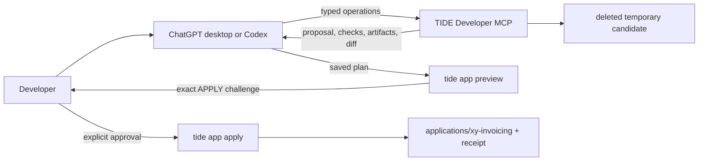

# Generate a TIDE Application with AI and Developer MCP

This tutorial turns a conversational invoicing request into a compiled TIDE
application without giving the MCP server authority to write source files.
Developer MCP proposes and previews; the local `tide app` command performs a
separate, evidence-bound approval before publishing a new application.

The checked-in reference plan is
[`examples/ai_generation/xy_invoicing_plan.json`](../examples/ai_generation/xy_invoicing_plan.json).
It defines Companies, Products, Invoices and Invoice Lines, a Post action, an
Invoice report with PDF capability, and separate creator/poster roles.

## The trust boundary



Developer MCP has no destination-path, arbitrary-file, arbitrary-Python,
shell-command, database, or apply tool. Its preview uses fixed TIDE-owned
templates and isolated in-memory services, then deletes the temporary candidate.
The application appears under `applications/` only after the separate local
command receives the exact approval phrase displayed for that candidate.

## 1. Install the local developer adapter

From the TIDE repository root:

```powershell
uv sync --extra mcp --extra report
```

`report` is optional, but including it lets the isolated preview verify both
HTML and PDF rendering rather than reporting PDF as a skipped check.

## 2. Connect ChatGPT desktop or Codex

Current local ChatGPT desktop, Codex CLI, and Codex IDE clients share MCP
configuration on the same Codex host. They can start a local STDIO server
directly; this workflow does **not** require a Control Plane API key, public URL,
Cloudflare tunnel, bearer token, or separately running server window. ChatGPT
web uses remotely supplied MCP tools and cannot launch this local process.

The [official Codex MCP instructions](https://learn.chatgpt.com/docs/extend/mcp)
describe both the desktop form and `config.toml` configuration.

### Desktop form

In the ChatGPT desktop app:

1. Open **Settings → MCP servers → Add server**.
2. Name it `TIDE Developer` and choose **STDIO**.
3. Set command to `uv`.
4. Add these arguments in order:

   ```text
   run
   --extra
   mcp
   tide
   mcp
   dev
   applications/invoicing
   ```

5. Set the working directory to the absolute TIDE repository path.
6. Save, restart the local Codex host, then type `/mcp` to verify the server and
   tools.

### Configuration file

Alternatively, copy the table from
[`examples/ai_generation/codex-mcp-config.toml`](../examples/ai_generation/codex-mcp-config.toml)
into `~/.codex/config.toml`. Replace its `cwd` placeholder with the absolute
repository path, then restart. A project-scoped `.codex/config.toml` also works
for a trusted repository, but the checked-in file is intentionally only a
template so cloning TIDE does not silently start optional processes.

The connected tool list should include:

```text
tide_validate_project
tide_list_entities
tide_describe_entity
tide_get_resolved_view
tide_preview_openapi
tide_propose_application
tide_preview_application
```

There is deliberately no `apply`, `write_file`, SQL, or shell tool.

## 3. Try the natural-language request

Start with the original product idea:

```text
Use the TIDE Developer MCP tools to design an invoicing application for XY
Company with Companies, Products, Invoices, and Invoice Lines. Invoice totals
must be computed from quantity and unit price. Include a Post action, an Invoice
report with PDF capability, and two roles: invoice creators can maintain master
data and create invoices, while invoice posters can read and post invoices.

First call tide_propose_application. If the proposal is valid, call
tide_preview_application. Do not apply changes or edit the workspace. Summarize
the generated entities, permissions, workflow, report, preview checks, exact
write-safety flags, and any questions you need me to decide.
```

The AI converts that request into the discriminated structured operations
advertised by the MCP tool schema. Natural-language results may differ in field
names or optional details; that is useful during design, provided proposal and
preview diagnostics are reviewed rather than silently ignored.

For a deterministic first test, use the checked-in reference instead:

```text
Read examples/ai_generation/xy_invoicing_plan.json. Submit that exact plan to
tide_propose_application and, if valid, tide_preview_application. Do not edit
or apply anything. Report proposal ID, candidate ID, check results, artifact
count, and every no-write/isolation flag.
```

The reference currently produces:

- four entities, one workflow, one report, and two roles;
- 22 deterministic application artifacts;
- compiled browse, form, lookup, and inline views;
- secured CRUD, denial, Post/idempotency, report, HTML, and PDF checks;
- `workspace_writes_performed: false`;
- `candidate_persisted: false`;
- `external_commands_executed: false`;
- `application_database_accessed: false`;
- `temporary_candidate_deleted: true`.

Proposal and candidate IDs are deterministic for an unchanged plan, but treat
them as opaque values rather than hard-coding them into automation.

## 4. Recheck the plan locally without writing

Save an AI-generated plan as JSON, or use the reference plan:

```powershell
uv run tide app preview examples/ai_generation/xy_invoicing_plan.json `
  --workspace .
```

For structured output:

```powershell
uv run tide app preview examples/ai_generation/xy_invoicing_plan.json `
  --workspace . --json
```

The result should report `ready: true`, `writes_performed: false`, destination
state `absent`, 22 artifacts, the exact source diff, and an approval prompt that
starts with `APPLY tide-approval-`. Preview does not create the `applications`
target.

Before approval, review at least:

- entity names, field types, references, inverse relationships, and field order;
- REST/MCP exposure and the permissions granted to each role;
- permitted Post source/target states, required lines, stamps, and idempotency;
- report header/detail/footer fields and PDF requirement;
- every compiler/runtime check and warning;
- the complete generated diff, including fixed-template `actions.py`;
- the no-write, no-database, and temporary-cleanup flags.

## 5. Apply only if the exact candidate is accepted

If you only wanted to test AI proposal/preview, stop here. To intentionally add
the generated application to this repository, run:

```powershell
uv run tide app apply examples/ai_generation/xy_invoicing_plan.json `
  --workspace .
```

TIDE displays the exact diff again and asks for the complete phrase shown for
the current candidate, for example `APPLY tide-approval-...`. There is no
`--yes` option. Incorrect or stale approval, an existing destination, changed
plan, case collision, symbolic-link hazard, or changed candidate fails closed.

After successful publication:

```powershell
uv run tide model validate applications/xy-invoicing
uv run tide api export-openapi applications/xy-invoicing
uv run --extra studio tide studio applications/xy-invoicing
```

The new tree contains `.tide-apply.json`, which records the proposal, approval,
candidate, diff, and artifact hashes. Commit the generated application only
after reviewing it like ordinary source. Existing applications are never
replaced by this flow; later changes use Studio or the Designer preview/save
boundary.

## What the AI can and cannot generate today

Implemented structured operations cover:

- a new application identity;
- entities, scalar/reference/collection fields, computed expressions, and
  constrained sequence numbers;
- REST and runtime-MCP exposure declarations;
- permissions and roles;
- constrained state-transition actions with optional stamps;
- one-record reports and PDF renderer intent;
- conventional browse, form, lookup, and inline views derived by TIDE.

The generation surface does not accept arbitrary Python, arbitrary paths,
external commands, database connections, existing-application replacement, or
an MCP-side approval. Business behavior that needs custom Python remains a
separate trusted development task and future approval unit.

## Troubleshooting the local connection

- **`uv` is not found:** confirm `uv --version` works in a new terminal. If the
  desktop host does not inherit that `PATH`, use the absolute `uv.exe` path as
  the server command.
- **The working directory fails on Windows:** use forward slashes such as
  `E:/Projects/TIDE`, or escape every backslash in TOML.
- **The server does not appear:** save the MCP entry, restart the local Codex
  host, then use `/mcp`. Project-scoped configuration is ignored until the
  repository is trusted.
- **Preview times out:** retain the template's 120-second tool timeout; the
  first `uv` launch and PDF check may need longer than the default 60 seconds.
- **The destination already exists:** new-application apply never replaces it.
  Choose a different `application_id` or use Studio/Designer for an intentional
  existing-application edit.
- **You are using ChatGPT web:** move this local STDIO test to ChatGPT desktop,
  Codex CLI, or the Codex IDE integration. Do not expose developer MCP through a
  temporary public tunnel merely to work around the local/remote distinction.

## CI proof

The tutorial artifacts are executable specifications:

```powershell
uv run pytest tests/test_ai_generation_tutorial.py
```

The test submits the checked-in plan to both developer MCP tools, asserts every
isolation flag and the generated diff, prepares approval without writing, then
applies into a pytest temporary workspace and recompiles the exact result. The
real repository never receives `applications/xy-invoicing` during CI.
