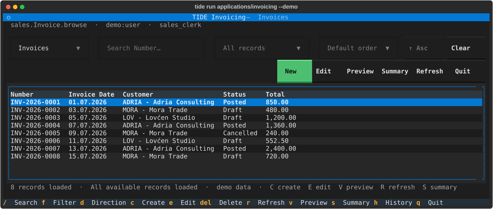

# Getting Started with TIDE Framework

This guide takes a clean checkout to a running application on every surface
TIDE has: the terminal client, the Web UI, Studio, REST, and MCP. Each step
says what it should print, and [When a step does not work](#when-a-step-does-not-work)
collects the failures that are worth recognising rather than debugging.

The first run uses isolated in-memory demo data, so nothing here requires or
changes a database.



## What you will run

TIDE Framework compiles application YAML into one validated application model.
The Textual TUI, the Web UI, Studio, REST/OpenAPI, runtime MCP, and reports all
consume that model and the same application services. The maintained
[Invoicing application](../applications/invoicing/README.md) is the golden
reference and demonstrates Customers, Products, Invoices, line items,
permissions, posting, reports, auditing, and optimistic concurrency.

Commands below are cross-platform. On Windows, `start.bat` wraps each of them
with the environment already prepared; `start.bat help` lists every mode, and
[Windows quick start](WINDOWS-QUICKSTART.md) covers them in detail.

## Prerequisites

- Python 3.11, the current development and CI-certified baseline; project
  metadata permits newer interpreters on a best-effort basis;
- [uv](https://docs.astral.sh/uv/) for dependency and environment management;
- Git;
- a terminal at least 80 columns wide for the TUI and Studio;
- **Node.js 20 or later — required for the Web UI**, which is built with Vite
  and is the only TIDE surface that runs on a phone. Nothing else on this page
  needs it;
- optional: Microsoft SQL Server and ODBC Driver 17 or newer for persistent
  testing;
- optional: Node.js 22.7.5 or newer for the browser-based MCP Inspector, which
  is a newer floor than the Web UI's.

## Five minutes: the terminal client

Clone the repository and install the complete development environment:

```bash
git clone https://github.com/djordjen/tide.git
cd tide
uv sync --extra dev
```

`--extra dev` installs every adapter this page uses — terminal, Studio, API,
client, MCP, migrations, reports, and the test tooling — so nothing below needs
a second install. The SQL Server driver is the one it leaves out, and the
optional section that needs it says so. The individual extras exist for
deployments that want less; see [Architecture](ARCHITECTURE.md).

Validate the reference application. This runs the compiler alone, with nothing
served and nothing opened, and is the quickest confirmation that the checkout
is sound:

```bash
uv run tide model validate applications/invoicing
```

```text
Model is valid: TIDE Invoicing 0.1.0 (4 entities, 9 views, 2 reports, 0 warning(s)).
```

Now open it:

```bash
uv run tide run applications/invoicing --demo
```

The `--demo` switch loads application-owned sample records into memory; closing
the process discards every change. The browse fills the terminal viewport and
appends another secured cursor batch as you scroll near the end, so **Previous**
and **Next** are not required. Press `q` to quit — the footer lists the keys
that are active on the current screen.

On Windows, `start.bat demo` is the same command.

For a screenshot-led tour that connects each screen to its application-owned
metadata, follow the
[Invoicing Application Walkthrough](INVOICING-WALKTHROUGH.md).

## Tour the Invoicing application

Use the workspace selector to move between **Invoices**, **Customers**, and
**Products**. A useful first workflow is:

1. Create a Customer or Product and save it.
2. Open Invoices and choose **New**.
3. Pick a customer, add a line, and open the searchable Product lookup with
   `F4`, Space, or Down.
4. Save the invoice, preview its report, and post it.
5. Start the auditor demo and inspect its action and CRUD history.

Important shortcuts include:

| Shortcut | Action |
| --- | --- |
| `Tab` or `Enter` | Move through editable fields |
| `Ctrl+S` | Save the current record |
| `Ctrl+N` | Add a line or create a lookup record |
| `Ctrl+P` | Post an eligible invoice |
| `V` | Preview the selected invoice report |
| `S` | Preview the posted-sales summary (asks for its date range first; blank means everything) |
| `H` | Show authorized audit history |
| `Esc` | Cancel or close the current screen |
| `q` | Quit |

The same application in its read-only role, which is what step 5 above asks
for:

```bash
uv run tide run applications/invoicing --demo --role auditor
```

On Windows, `start.bat auditor-demo`.

## Run the Web UI

The Web UI is a generic React renderer for compiled TIDE applications: the
browser code contains no Invoicing-specific entities, fields, routes, or
layouts. It is also the only surface a phone can run, so it is responsive down
to 375 pixels.

It signs users in itself rather than accepting a bearer token from the address
bar, which means it needs a TIDE-owned identity store. Create it once. The
store is a SQLite file holding only credentials and roles — it is not the
application database, and `--demo` data never lands in it:

```bash
uv run tide auth create-user applications/invoicing \
  --store .tide/local-auth.sqlite3 --username admin \
  --role sales_clerk --role auditor
```

The command prompts for a password and echoes nothing. It then prints:

```text
Created local user 'admin' for TIDE Invoicing with role(s): auditor, sales_clerk
Identity store: .tide/local-auth.sqlite3
```

Now start the API and the renderer together. The first `npm ci` installs the
locked dependencies and takes a minute:

```bash
cd web && npm ci && npm run dev:demo
```

A browser opens on the sign-in screen. Sign in as `admin` with the password you
chose; the password and the opaque session cookie are never written to browser
storage. Stop both processes with `Ctrl+C`.

On Windows, `start.bat web-demo` performs all of the above, including creating
the account on first use.

What to try, in the order the slices were built:

- the shell's grouped, capability-filtered navigation, which collapses into one
  workspace select on a narrow screen;
- **Products** or **Customers**, then **New** — defaults, required fields,
  choices, masks, and numeric constraints all come from the compiled model, and
  validation messages arrive from the server beside their fields;
- a Draft **Invoice**, then **Select…** beside Customer — the multi-column
  window searches the YAML-declared Code, Name, and Email fields, and
  **New Customer → Save & Select** completes a nested form without losing the
  Invoice draft;
- **Add line**, which follows the shared `sales.InvoiceLine.inline_edit`
  layout, and whose Product lookup returns Description and Unit Price from the
  server rather than the browser;
- **Posted Sales Summary** from the Invoice list, and **Preview Invoice** from a
  saved Invoice — both offer CSV, standalone HTML, and PDF export, each rebuilt
  and reauthorized server-side;
- the address bar, which carries the open view and record as `?view=` and
  `?record=`, so any screen can be linked to and survives a refresh.

Selection, defaults, validation, and totals are all decided by the same
services the terminal client calls. The browser receives no database
connection and no report query.

To host a built renderer from the API process instead of running Vite:

```bash
cd web && npm ci && npm run build && cd ..
```

```bash
uv run tide serve applications/invoicing --demo \
  --auth local --local-auth-store .tide/local-auth.sqlite3 \
  --web-root web/dist
```

Open <http://127.0.0.1:8000>. API routes are registered before the static
renderer, so Web hosting cannot shadow `/api`, `/docs`, OpenAPI, health, or MCP
routes.

See [Web UI](WEB-UI.md) for the architecture, security boundary, production
build, and current limitations, and [Web authentication](WEB-AUTHENTICATION.md)
for local user management, password changes, cookies, CSRF, and production OIDC
login.

## Open TIDE Studio

Studio shows the **resolved** model, which no editor can: a view with its
presets and overlays merged, where each field came from, and how the result
looks to a chosen role at a chosen terminal size. It also provides a structured
application tree, typed property editors, view-layout tools, searchable
syntax-colored YAML, validation, exact diffs, undo/redo, and an approval-bound
save workflow.

```bash
uv run tide studio applications/invoicing
```

On Windows, `start.bat studio`.

Studio first changes an in-memory candidate. **Save candidate** shows the exact
files and diff, then requires the displayed approval phrase before using the
transactional YAML save service. Closing an unsaved session changes no source
files. See [Designers and reporting](DESIGNERS-AND-REPORTING.md) for the safety
and recovery contracts.

## Inspect the application model

The compiler can explain the resolved origin and metadata of an application
member without opening anything:

```bash
uv run tide model explain sales.Invoice.total --project applications/invoicing
```

```bash
uv run tide view explain sales.Invoice.edit --project applications/invoicing
```

Both print JSON. Applications live below `applications/<name>/`, separate from
the framework runtime. An application normally owns:

```text
applications/<name>/
  tide.yaml
  models/
  views/
  presentation/
  reports/
  security/
  runtime.py       # optional application behavior registration
```

YAML remains the authoring format. It is compiled into an immutable normalized
model before a renderer or data adapter can use it. See the
[application model](APPLICATION-MODEL.md) and
[metadata v0.1 reference](METADATA-V0.md) for the accepted contract.

## Author YAML in your editor

An ordinary editor is the best place to write the authoring format.
`tide model schema` exports a JSON Schema for each source kind from the same
Pydantic models the compiler loads, and all eight are checked in under
`schemas/`, so a fresh clone needs no build step.

VS Code is wired up already: `.vscode/settings.json` maps each application path
to its schema, so with the
[YAML extension](https://marketplace.visualstudio.com/items?itemName=redhat.vscode-yaml)
installed you get property completion, enumerated values for `type:`, `kind:`
and `on_delete:`, and an inline error on an unknown key — against the real
contract rather than a copy of it. Any editor with JSON Schema support can read
the same files. Regenerate one with:

```bash
uv run tide model schema entity --output schemas/entity.json
```

`tests/test_source_schema.py` holds this honest in three directions: a
checked-in schema must equal a fresh export, the editor's globs must classify
exactly the files each application's `tide.yaml` declares, and every checked-in
document must validate against the schema it is mapped to. The last of those is
not theoretical — it found the `transition` block advertising `from` as a list
when the loader also accepts a plain string, which is how both applications
write it.

Schema validation is not the compiler. It checks one document's shape;
`tide model validate` checks references, expressions, permissions, and
everything that spans files.

## Run REST and OpenAPI locally

`tide serve` binds to loopback and requires a development bearer token of at
least 32 characters. Generate one and export it:

```bash
export TIDE_API_TOKEN=$(uv run python -c "import secrets; print(secrets.token_urlsafe(32))")
```

In PowerShell, assign it with `$env:TIDE_API_TOKEN = ...` instead. Then:

```bash
uv run tide serve applications/invoicing --demo
```

```text
Serving TIDE Invoicing at http://127.0.0.1:8000 (docs: /docs; identity: development:api; development auth only).
```

On Windows, `start.bat api-demo` generates the token, prints it, and starts the
same server.

Open <http://127.0.0.1:8000/docs>, choose **Authorize**, and paste the token to
exercise the generated contract. TIDE serves that page from its own files
rather than from a CDN, so it works offline and under TIDE's own
content-security policy.

After authorizing, try `GET /api/v1/_tide/presentation`. It returns the safe,
principal-specific application navigation and browse contract intended for
remote renderers: columns, search, named filters, sorting, server fetch size,
and REST paths. It deliberately excludes raw YAML, permission rules, Python
handlers, and the database connection.

To inspect the generated OpenAPI document without starting a server:

```bash
uv run tide api export-openapi applications/invoicing
```

`serve` on its own is REST and the API description. It serves the Web UI only
when given `--web-root`, and mounts MCP only when given `--mcp`.

See [REST API and MCP](API-AND-MCP.md) for filtering, ETags, idempotency,
production identity, and deployment requirements. The request limits, logging,
correlation identifiers, and health endpoints that a deployment has to reason
about are in [Operational baseline](OPERATIONS.md); the defaults are already
correct for a laptop.

### Call it from a client

With a server running, a second terminal can drive it. The remote TUI receives
no database URL — browse, lookup, mutation, report, concurrency, and action
calls all pass through FastAPI and the server-side services:

```bash
uv run tide api check-server applications/invoicing --url http://127.0.0.1:8000
```

```text
Connected to TIDE Invoicing 0.1.0 as development:api (14 operation(s), 2 action(s)).
```

It reads the same `TIDE_API_TOKEN`. On Windows, `start.bat api-check` and
`start.bat remote` do this and prompt securely for the printed token.

For a complete executable client example, follow
[Call a TIDE Application Through REST](API-CLIENT-TUTORIAL.md). With the server
still running, the second terminal command is:

```bash
uv run python examples/invoicing_api_client.py
```

The client prompts for the token, then demonstrates Product defaults, Invoice
create/update, validation and stale-ETag failures, idempotent Post, correlated
audit history, and the secured report contract. It has no database connection
string.

## Test runtime MCP locally

Runtime MCP gives an authenticated AI client explicitly exposed application
resources and tools. It never receives a repository, arbitrary SQL capability,
database credentials, or project source-write authority.

```bash
uv run tide serve applications/invoicing --demo --mcp
```

```text
Serving TIDE Invoicing at http://127.0.0.1:8000 (docs: /docs; identity: development:api; development auth only; MCP: http://127.0.0.1:8000/mcp).
```

On Windows, `start.bat mcp-demo`. For a local browser-based inspection UI, run:

```bash
npx -y @modelcontextprotocol/inspector@latest
```

In MCP Inspector select **Streamable HTTP**, enter the URL from the banner, and
paste the bearer token into its bearer-token setting. Start with a read
operation such as `search_catalog_product`, then exercise the generated
create/update tools or the idempotent `post_sales_invoice` action. The demo
process discards all changes when it stops.

ChatGPT web requires remotely supplied MCP tools and cannot launch this local
HTTP process directly. Local ChatGPT desktop/Codex clients can configure MCP on
their Codex host; keep that developer workflow separate from exposing a runtime
data server over the internet.

Developer MCP is a different, local stdio surface for inspecting and proposing
TIDE application definitions:

```bash
uv run tide mcp dev applications/invoicing
```

It can produce deterministic proposals and validated candidate artifacts, but
cannot apply them or write arbitrary workspace files. See
[Generate a TIDE Application with AI and Developer MCP](AI-GENERATION-TUTORIAL.md)
for the complete ChatGPT desktop/Codex setup, example prompt, checked-in plan,
expected output, and explicit local approval walkthrough. The architectural and
security contract remains in
[AI-assisted application generation](AI-APPLICATION-GENERATION.md).

## Create another application

`applications/invoicing` is a reference application, not a hard-coded part of
the runtime. The generated
[Contacts application](../applications/contacts/README.md) is the portability
proof, and every command on this page accepts it in place of `invoicing`:

```bash
uv run tide model validate applications/contacts
```

```text
Model is valid: TIDE Contacts 0.1.0 (2 entities, 6 views, 0 reports, 0 warning(s)).
```

```bash
uv run tide run applications/contacts --demo
```

Additional applications belong in independent `applications/<name>/`
directories and may define different models, views, reports, security,
mappings, and optional handlers.

There is not yet a general `tide new` wizard. Today, developers can either:

- follow [Build Your First TIDE Application](FIRST-APPLICATION.md), which
  starts from an empty directory; its plan, exact generated baseline, approval
  path, services, storage, and renderer contracts are validated in CI;
- create the manifest and YAML files directly using the metadata references;
- use the Invoicing structure as a reviewed example; or
- use developer MCP to prepare a structured proposal, then review and apply it
  through the separate approval-required local command.

Always validate a new application before running it:

```bash
uv run tide model validate applications/<name>
```

## Use the local SQL Server database on Windows

This step is optional, and the only one needing an extra that `--extra dev`
does not install: the SQL Server modes add `--extra sqlserver` for the `pyodbc`
driver, which `start.bat` passes for you. The repository shortcut targets the
local `TIDE` database on port `1433` with Windows integrated security. Review
`start.bat` before changing that development connection.

Initialize TIDE-owned managed tables once, then seed, check, and run:

```powershell
.\start.bat init
.\start.bat seed
.\start.bat check
.\start.bat diff
.\start.bat
```

`diff` is inspection-only: it prints the deterministic managed migration
proposal and never applies DDL. A clean initialized database reports no
differences. A changed database/model can be passed to the separate
fingerprint- and approval-bound `tide db revision` command to create review
files inside the application. `tide db render-sql` with `--extra migration`
then verifies those files and creates dialect-specific SQL without a database
connection; TIDE still cannot apply it. See [Schema migrations](MIGRATIONS.md).

Use `start.bat auditor` for the persisted read-only audit/report workspace.
For an externally owned schema that TIDE must not change, follow the separate
[legacy database no-DDL contract](LEGACY-DATABASES.md). Complete driver,
connection, and troubleshooting guidance is in
[Microsoft SQL Server](SQL-SERVER.md).

For a path-based SQLite deployment, create a non-overwriting online backup and
verify its adjacent SHA-256 manifest:

```bash
uv run tide db backup applications/invoicing --database-env --output backups/invoicing.db
```

```bash
uv run tide db verify-backup applications/invoicing backups/invoicing.db
```

SQL Server continues to use native DBA-managed backup and a real isolated
restore drill; TIDE validates the restored application and framework schema
with `tide db check`. Follow the full
[backup and recovery runbook](OPERATIONS.md#database-changes-and-recovery)
before a production release or migration.

## Run the project checks

```bash
uv run ruff check .
```

```bash
uv run pytest
```

The complete suite includes compiler, security, services, repositories,
SQL-policy compilation, TUI, Studio, REST/OpenAPI, MCP, report, generation, and
local documentation contract tests, and takes about three minutes. Live SQL
Server tests remain explicitly opt-in. [Contributing](../CONTRIBUTING.md) has
the parallel invocation CI uses and the conventions a change is expected to
follow.

## When a step does not work

**`API startup failed: development bearer-token environment variable
'TIDE_API_TOKEN' is not set`** — `tide serve` will not start without one, and
it must be at least 32 characters. Generate and export it as shown under
[Run REST and OpenAPI locally](#run-rest-and-openapi-locally), or use
`start.bat api-demo`, which does it for you. Setting the variable in one
terminal does not set it in another.

**`API startup failed: local identity store is not initialized`** — `--auth
local` reads an existing store; it does not create one. Run the
`tide auth create-user` command under [Run the Web UI](#run-the-web-ui) first,
pointing `--store` at the same path.

**The Web UI will not start, or `npm` is not found** — the Web UI needs Node.js
20 or later. Nothing else on this page does, so the rest of TIDE works without
it.

**The terminal client looks cramped or truncated** — the TUI and Studio expect
at least 80 columns. Studio is more comfortable well above that; the checked-in
captures use 140.

**`[Errno 10048]` or `address already in use`** — a previous `tide serve` is
still running, or something else holds port 8000. Stop it, or pass
`--port 8001`.

**The demo data looks wrong, or an edit vanished** — `--demo` is in-memory by
design. Every change is discarded when the process stops. Use `--database-env`
for anything that should persist.

## Where to go next

- [Windows quick start](WINDOWS-QUICKSTART.md) — every `start.bat` mode and
  Windows troubleshooting.
- [Web UI](WEB-UI.md) — architecture, production build, and tests for the
  React renderer.
- [Web authentication](WEB-AUTHENTICATION.md) — configure production browser
  OIDC login without exposing provider tokens to React.
- [Architecture](ARCHITECTURE.md) — service, model, repository, and adapter
  boundaries.
- [Security](SECURITY.md) — permissions, protected values, authentication, and
  fail-closed behavior.
- [Operational baseline](OPERATIONS.md) — request limits, logging, health, and
  recovery.
- [Compilation and application layout](COMPILATION-AND-LAYOUT.md) — metadata
  compilation, packaging, and future bytecode/native deployment options.
- [Roadmap](ROADMAP.md) — implemented milestones and remaining work.

Run `uv run tide --help` on any platform, or `start.bat help` on Windows, for
the current command summary.
